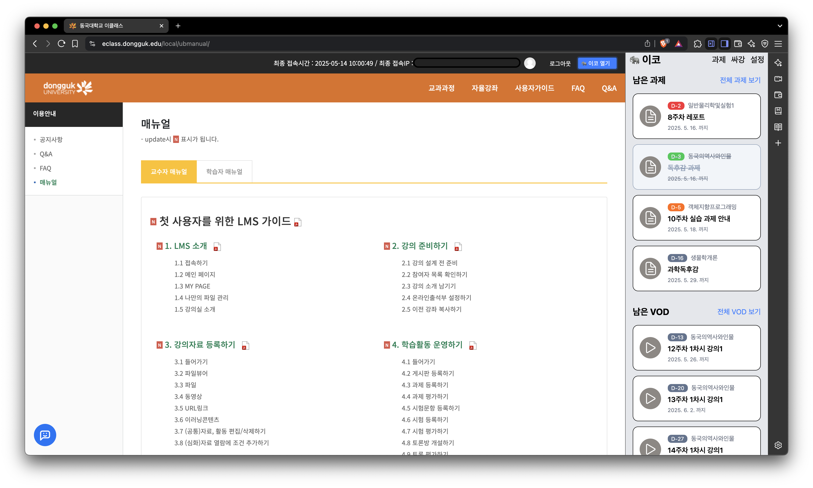

# 이코: 이클래스 도와주는 코끼리

<p align="center">
  <br>
  <br>
  <a href="LICENSE"></a>
  <a href="https://chromewebstore.google.com/detail/이코-이클래스-도와주는-코끼리/jmcmadbhcejffmkgomehebjpglhfmggp"></a>
  <a href="https://chromewebstore.google.com/detail/이코-이클래스-도와주는-코끼리/jmcmadbhcejffmkgomehebjpglhfmggp"></a>
  <br>
</p>



[](https://skillicons.dev)

- 동국대학교 eclass 과제, 사이버 강의 현황 확인 크롬 확장 프로그램
- 아직 개발중입니다...!
- PR, 기여 환영합니다. 소스코드가 많이 더럽습니다.

## 폴더구조

```
ecko/
├── src/                  # 확장 프로그램 소스 코드
│   ├── service-worker/   # 백그라운드 스크립트
│   ├── content-scripts/  # 콘텐츠 스크립트
│   ├── side-panel/       # 사이드 패널 UI React 코드
│   └── types/            # 공통 타입 정의
├── assets/               # 아이콘 등 정적 파일
├── package.json
├── manifest.json
├── vite.config.ts        # 번들러 config 파일
└── README.md
```

## 개발 환경 세팅 및 빌드

```bash
git clone https://github.com/karpitony/dgu-ecko.git
cd dgu-ecko
```

```bash
npm install -g pnpm@10.5.2
pnpm install
pnpm run build
```

- 이 프로젝트는 `pnpm`을 사용합니다.
- 현재 수정 시마다 `pnpm run build` 후 크롬 확장 프로그램 관리 페이지에서 다시 업로드해야 합니다.

## 기여하기

- 포크 후 PR을 편하게 보내주세요.
- 이슈나 개선점은 자유롭게 제안해 주세요.
- 커밋 메시지는 명확하고 간결하게 작성 부탁드립니다.
  - `feat/fix/chore/refactor/style: 메시지` 형태로 적으면 좋고, 별도의 body, footer 등은 없습니다.
