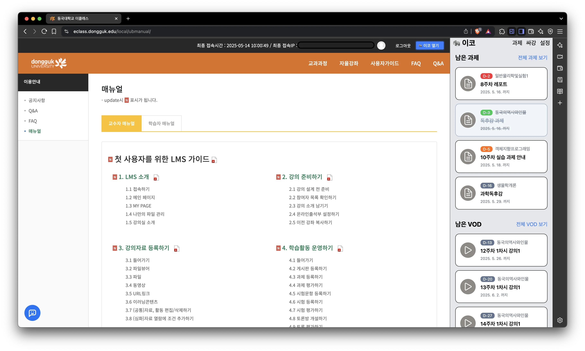
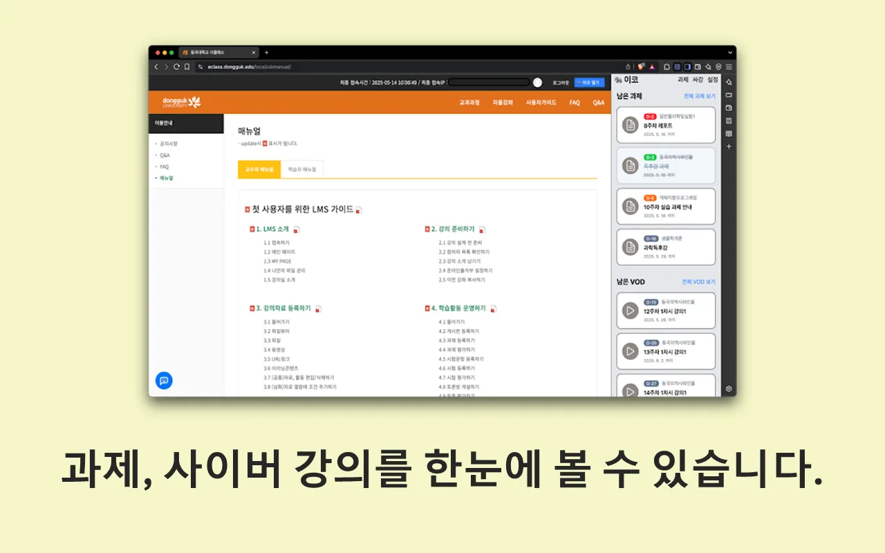
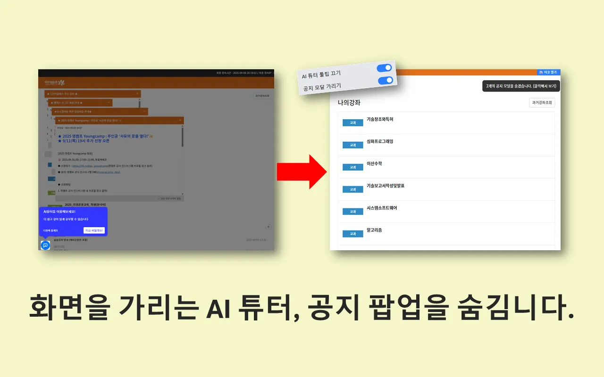
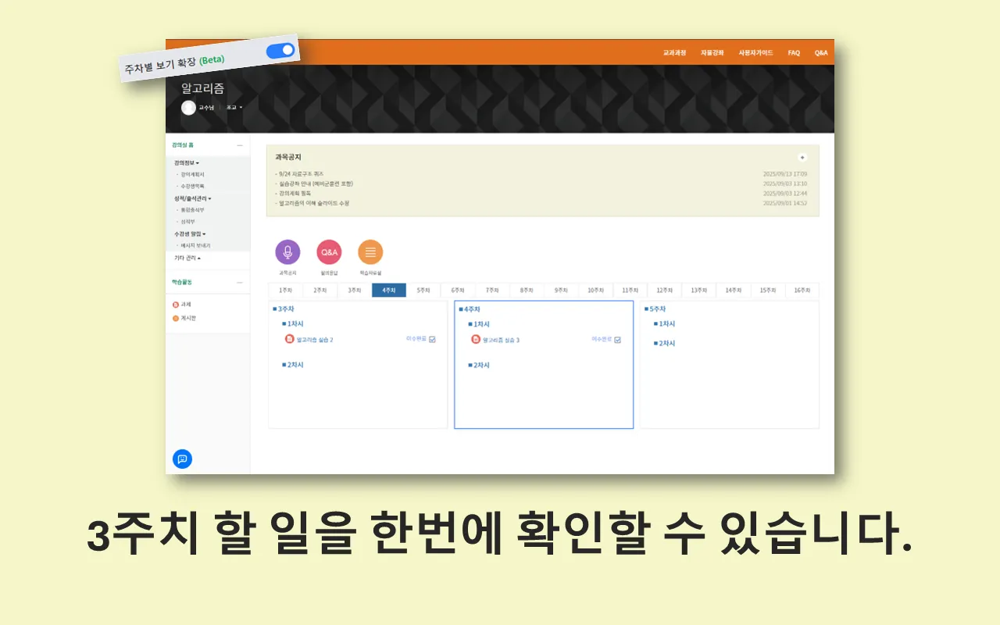

# 이코: 이클래스 도와주는 코끼리

   
  
  
  
   

- [한 줄 소개](#한-줄-소개)
- [개발 배경](#개발-배경)
  - [1. 복잡한 과제와 사이버 강의 현황 파악](#1-복잡한-과제와-사이버-강의-현황-파악)
  - [2. 마감 임박한 과제 / 사이버 강의 관리](#2-마감-임박한-과제--사이버-강의-관리)
  - [3. 화면을 가리는 UI 요소들](#3-화면을-가리는-ui-요소들)
  - [따라서](#따라서)
- [주요 기능](#주요-기능)
  - [1. 강의별 과제 & 사이버 강의 통합 뷰](#1-강의별-과제--사이버-강의-통합-뷰)
  - [2. 화면을 가리는 방해 요소 제거](#2-화면을-가리는-방해-요소-제거)
  - [3. 강의 페이지 3주차씩 보기](#3-강의-페이지-3주차씩-보기)
  - [4. 알림 오류 수정](#4-알림-오류-수정)
- [기여하기](#기여하기)
- [기술 스택](#기술-스택)

## 한 줄 소개

> **이코(Ecko)는** 동국대학교 eclass의 불편함을 개선하여  
> 과제와 사이버 강의를 한눈에 볼 수 있게 해주는 크롬 확장 프로그램입니다.

- 👉 [바로 설치하러 가기](https://chromewebstore.google.com/detail/이코-이클래스-도와주는-코끼리/jmcmadbhcejffmkgomehebjpglhfmggp)

## 개발 배경

**이코 (이클래스 도와주는 코끼리)** 는 컴퓨터 공학을 배우며 일상에서 느낀 불편함을 해결하고자 시작한 프로젝트입니다.

과제, 사이버 강의(녹화 영상), 교수님 공지를 확인하기 위해 eclass를 자주 사용해야 했고, 자연스럽게 사용 경험 전반에서 여러 불편함을 느끼게 되었습니다. 특히 2학년이 되며 새로운 eclass가 도입된 이후, 기존 시스템에 비해 기능과 UX가 오히려 퇴보했다고 느꼈고, 이를 개선해보고자 했습니다.

### 1. 복잡한 과제와 사이버 강의 현황 파악

먼저, 여러 강의를 동시에 수강하는 환경에서 **과제와 사이버 강의 현황을 파악하는 과정이 지나치게 비효율적**이었습니다. 보통 한 학기에 6~7개의 강의를 듣게 되는데, 각 강의실에 직접 들어가야만 과제와 영상 현황을 확인할 수 있었고, 이 과정을 반복하는 것은 시간이 오래 걸리고, 번거로울 뿐만 아니라 중요한 항목을 놓칠 가능성도 있었습니다.

eclass에서 제공하는 `예정된 할일` 기능이 존재하긴 했지만, 채점 마감일이나 아직 공개되지 않은 과제 등 불필요한 정보까지 함께 노출되어 실제로 필요한 정보만 빠르게 파악하기에는 적합하지 않았습니다.

### 2. 마감 임박한 과제 / 사이버 강의 관리

또한, **마감이 임박한 과제나 강의를 직관적으로 인지하기 어려운 점**도 문제였습니다. 기존 eclass에서는 D-day 기반으로 정렬된 목록을 통해 자연스럽게 우선순위를 파악할 수 있었지만, 개편 이후에는 이러한 기능이 사라지면서 ‘지금 당장 해야 할 일’을 한눈에 파악하기 어려워졌습니다. 단순히 정보를 나열하는 것을 넘어, 사용자에게 행동 우선순위를 전달하는 방식의 인터페이스가 필요하다고 느꼈습니다.

### 3. 화면을 가리는 UI 요소들

마지막으로, **사용 흐름을 방해하는 UI 요소들**도 반복적인 스트레스를 유발했습니다. 강의실 목록을 가리는 공지 팝업, 전체 화면을 덮는 안내 모달, AI 채팅창 등은 매번 수동으로 닫아야 했고, 이러한 경험은 단순한 불편함을 넘어 서비스 전반의 사용성을 저하시킨다고 느꼈습니다. 실제로 주변 학우들도 동일한 불편을 겪고 있었고, 이는 개인적인 문제가 아니라 구조적인 UX 문제라고 생각했습니다.

### 따라서

이러한 문제 인식을 바탕으로, **과제와 사이버 강의 현황을 한눈에 확인하고, 마감 기준으로 우선순위를 파악할 수 있으며, 불필요한 UI를 제거한 환경을 제공하는 것**을 목표로 크롬 확장 프로그램 **이코**를 개발하게 되었습니다.

## 주요 기능

### 1. 강의별 과제 & 사이버 강의 통합 뷰

상단에 추가된 파란색 `🐘 이코 열기` 버튼을 클릭하면 모든 강의의 과제와 사이버 강의를 **한 화면에서 확인**할 수 있습니다.

마감일과 남은 기간에 따라 노란색에서 빨간색까지 D-Day와 색으로 강조되며 마감일 전 과제를 제출했거나 수강을 완료하였다면, 초록색과 취소선으로 표시됩니다.

> ※ 마감일이 지나면 표시되지 않습니다.

### 2. 화면을 가리는 방해 요소 제거

공지 팝업을 자동으로 가리고, 전체 화면을 가리는 모달을 차단합니다.

> 이 기능은 처음 설치시 기본으로 켜져있고, 설정에서 끌 수 있습니다.

### 3. 강의 페이지 3주차씩 보기

기존 1주차 단위 UI를 3주차씩 확장하여 한 번에 확인할 수 있도록 개선했습니다.

> 이 기능은 처음 설치시 기본으로 켜져있고, 설정에서 끌 수 있습니다.

### 4. 알림 오류 수정

eclass의 알림 숫자가 갱신되지 않는 문제를 보완하기 위해,

처음 접속 시의 알림 개수(예: 24개)를 기억하고, 후에도 알림이 24개면 '0개'로 표시하고, 새 알림이 와서 25개가 되면 '1개'로 표시합니다.

> (2026.03 기준 기본값 ON, 추후 문제 해결 시 OFF 예정)

## 기여하기

**이코**는 오픈소스 프로젝트입니다. 여러분의 기여를 환영합니다!

- 🐞 버그를 발견하셨나요? [이슈](https://github.com/karpitony/dgu-ecko/issues)를 등록해 주세요.
- 💡 새로운 기능을 제안하고 싶으신가요? 이슈 혹은 PR을 보내주세요.
- 📖 프로젝트 구조, 개발 환경 세팅 등 자세한 내용은 [CONTRIBUTING.md](./CONTRIBUTING.md)를 참고해 주세요.

## 기술 스택

- 크롬 확장 프로그램을 쉽게 만드는 WXT 기반의 TypeScript 프로젝트입니다.
- UI 라이브러리로 리액트를 사용했습니다.
